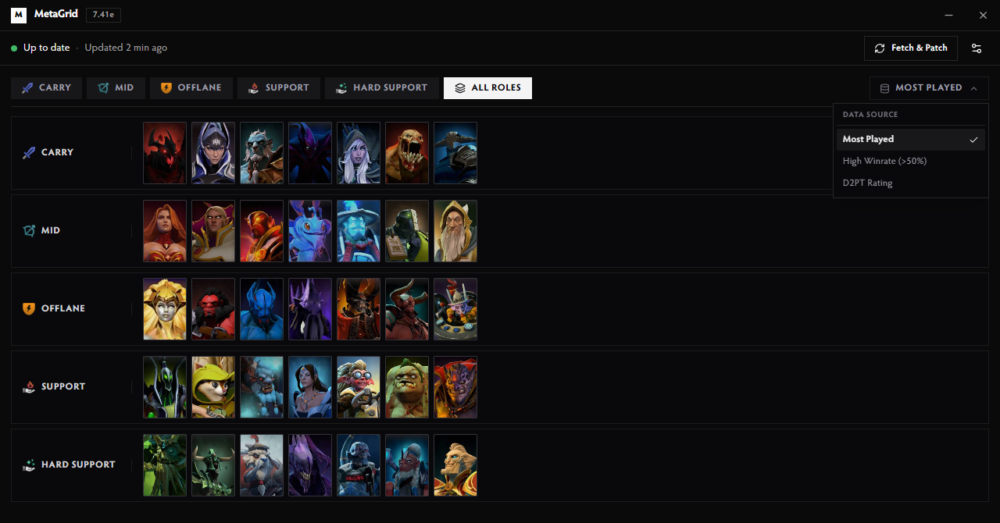

<div align="center">
  <picture>
    <source media="(prefers-color-scheme: dark)" srcset=".github/logo-dark.svg">
    <source media="(prefers-color-scheme: light)" srcset=".github/logo-light.svg">
    
  </picture>

  <h1>MetaGrid</h1>
  <p>Automated Dota 2 hero grids synchronized with official high-MMR Dota2ProTracker meta statistics.</p>
</div>

<div align="center">

[](LICENSE)
[](https://www.microsoft.com/windows)
[](https://v2.tauri.app)
[](https://svelte.dev)
[](https://www.rust-lang.org)
[](https://www.typescriptlang.org)

</div>

<div align="center">
  <a href="#overview">Overview</a> &middot;
  <a href="#d2pt-terms-of-service-compliance">D2PT ToS Compliance</a> &middot;
  <a href="#screenshots">Screenshots</a> &middot;
  <a href="#features">Features</a> &middot;
  <a href="#installation">Installation</a> &middot;
  <a href="#configuration">Configuration</a> &middot;
  <a href="#development">Development</a>
</div>

---

## Overview

MetaGrid is an automated Windows desktop application and background tray utility for Dota 2. It synchronizes live high-MMR meta statistics directly from [dota2protracker.com](https://dota2protracker.com) and keeps your in-game hero selection layouts updated across all positions (Carry, Mid, Offlane, Support, Hard Support).

**Set and forget**: MetaGrid runs silently in the Windows system tray. It automatically syncs hero grids on your preferred interval and immediately updates your Steam configuration with native Steam Cloud validation, so your layouts load instantly on the very first launch.

Grids are written directly to Dota's `hero_grid_config.json`. Existing user-created custom grids are safely preserved with zero distortion, and automatic `.metagrid.bak` backups are created on every write.

> [!TIP]
> **100% VAC & Matchmaking Safe — Zero Ban Risk**
> MetaGrid is completely safe to use and will never trigger VAC or game bans:
> - **No Process Injection or Memory Access**: MetaGrid never injects DLLs, reads/writes `dota2.exe` memory, or hooks game functions.
> - **Native JSON Configuration Only**: It strictly writes to `hero_grid_config.json` in your local `Steam/userdata/` folder — the exact same file Dota 2 modifies when you arrange heroes in the in-game layout editor.
> - **External Public Data**: Meta statistics are fetched directly from Dota2ProTracker via standard HTTPS calls, completely independent of the Dota 2 game client or Steam network traffic.

---

## D2PT Terms of Service Compliance

To strictly adhere to [Dota2ProTracker's](https://dota2protracker.com) Terms of Service and eliminate aggressive HTML scraping/bot extraction, MetaGrid integrates with D2PT's official automated hero grid download endpoints (`/meta-hero-grids/download?mode={mode}&patch=latest`).

- **Official Grid Endpoints**: Fetches curated, server-generated hero grid configs directly without scraping HTML pages or bypassing anti-bot protections.
- **Respect for D2PT Infrastructure**: Uses minimal, clean API calls strictly on user demand or debounced background refresh intervals.
- **Accurate Meta & Matchups**: Ingests D2PT's top hero tiers and matchup synergy categories (Best with, Worst with, Best against, Worst against) natively.

---

## Screenshots

<div align="center">

### All Roles Overview


<br/><br/>

### Role Meta & Matchup Synergies


<br/><br/>

### In-Dashboard Data Source Quick Switcher


<br/><br/>

### In-Game Hero Grid Modes (Separate vs Merged)

<table>
  <tr>
    <th width="50%" align="center"><b>Separate Mode</b><br/><sub>6 Standalone Official D2PT Layouts</sub></th>
    <th width="50%" align="center"><b>Merge Mode</b><br/><sub>Live Compact META Injected into Existing Custom Grid</sub></th>
  </tr>
  <tr>
    <td align="center">
      
    </td>
    <td align="center">
      
    </td>
  </tr>
</table>

<br/><br/>

### Settings & Preferences


</div>

---

## Features

- **Automated Background Sync**: Runs silently in the system tray, automatically updating hero grids on your chosen schedule (`15m` to `24h`).
- **Official D2PT Hero Grids**: Directly imports official Dota2ProTracker hero grids with zero scraping.
- **Top Heroes & Synergies**: Detailed breakdown of top 7 meta heroes for each role alongside their 4 key matchup categories:
  - **Best with** & **Worst with** (teammate synergies)
  - **Best against** & **Worst against** (counter matchups)
- **All Roles Glance View**: Unified screen-fitting overview of top 7 meta heroes across all 5 roles.
- **Instant Data Source Switching**: Switch between **Most Played**, **High Winrate (>50%)**, and **D2PT Rating** on the fly from the dashboard.
- **Dual Grid Modes**:
  - **Separate**: Writes all 6 official D2PT grids (`Dota2ProTracker - All Roles`, `Carry`, `Mid`, `Offlane`, `Support`, `Hard Support`) intact.
  - **Merge**: Injects clean 7-hero-per-role meta categories (`META CARRY`, `META MID`, etc.) directly into your existing custom layout on the left, shifting your existing categories with zero distortion.
- **Multi-Account Discovery**: Automatically detects all local Steam user accounts under `Steam/userdata/<id>/570/remote/cfg/`.
- **Atomic File Operations**: Safe write mechanism with automatic rollback and `.metagrid.bak` backups.
- **Bilingual Interface**: Full interface support for English and Russian.

---

## Installation

### Windows (64-bit & 32-bit Installer)

1. Download `MetaGrid_x64-setup.exe` (or `MetaGrid_x86-setup.exe` for 32-bit systems) from [Releases](https://github.com/maybewewill/metagrid/releases).
2. Run the installer and launch MetaGrid.
3. Select your Steam account and language, then click **Fetch & Patch**.
4. In Dota 2, open **Heroes → Hero Grids** and select your updated layout.

---

### macOS (Homebrew / Universal DMG)

#### 1. Homebrew
```bash
brew install --cask maybewewill/tap/metagrid

# Or:
# brew tap maybewewill/tap && brew install --cask metagrid
```

#### 2. Manual DMG Download
1. Download `MetaGrid_1.4.1_universal.dmg` from [Releases](https://github.com/maybewewill/metagrid/releases).
2. Open the `.dmg` file and drag **MetaGrid** into your `Applications` folder.
3. Launch MetaGrid, select your Steam account, and click **Fetch & Patch**.

---

### Linux (AppImage / .deb / Arch pacman)

> [!WARNING]
> **Linux & macOS Support (Experimental / Community Testing)**:
> Native Steam discovery is implemented in code and verified by unit tests, but has **not yet been comprehensively field-tested across every live environment**. Feedback, issue reports, and PRs are warmly welcome!

#### 1. Arch Linux / Manjaro / EndeavourOS (`pacman`)
```bash
sudo pacman -U https://github.com/maybewewill/metagrid/releases/latest/download/metagrid-x86_64.pkg.tar.zst
```

#### 2. Debian / Ubuntu / Linux Mint / Pop!_OS (`apt`)
```bash
curl -sLO https://github.com/maybewewill/metagrid/releases/latest/download/MetaGrid_amd64.deb && sudo apt install -y ./MetaGrid_amd64.deb && rm MetaGrid_amd64.deb
```

#### 3. Universal AppImage (Runs on all Linux distributions, Fedora, openSUSE & Steam Deck / SteamOS)
```bash
curl -sLO https://github.com/maybewewill/metagrid/releases/latest/download/MetaGrid_amd64.AppImage && chmod +x MetaGrid_amd64.AppImage && ./MetaGrid_amd64.AppImage
```

---

### Build from Source (Cargo)

```bash
cargo install --git https://github.com/maybewewill/metagrid
```

---

## Configuration

| Setting | Options | Description |
| :--- | :--- | :--- |
| **Data Source** | `Most Played` / `High Winrate (>50%)` / `D2PT Rating` | Select hero ranking algorithm (sorted by match volume, positive winrate meta, or D2PT rating). |
| **Grid Mode** | `Separate` / `Merge` | Choose between 6 standalone role grids or injecting a live META column into an existing custom grid. |
| **Target Grid** | Custom grid name | Select which existing hero layout to inject the META column into (when Merge mode is active). |
| **Refresh Interval** | `15m`, `30m`, `1h`, `3h`, `6h`, `12h`, `24h` | Background scheduler sync interval. |
| **Steam Account** | `All accounts` or specific Steam ID | Target account selection. |
| **Start with Windows** | `Enabled` / `Disabled` | Launch minimized on system startup. |
| **Language** | `English` / `Russian` | UI language and grid category names. |

---

## Development

### Prerequisites
- Node.js 20+
- Rust 1.85+ stable (with MSVC toolchain)

### Commands

```bash
# Install dependencies
npm install

# Start development mode
npm run tauri dev

# Run frontend tests
npm test

# Run type checks
npm run check

# Run Rust tests
cargo test --manifest-path src-tauri/Cargo.toml

# Build release installer
npm run tauri build
```

---

## License

Distributed under the [MIT License](LICENSE).

