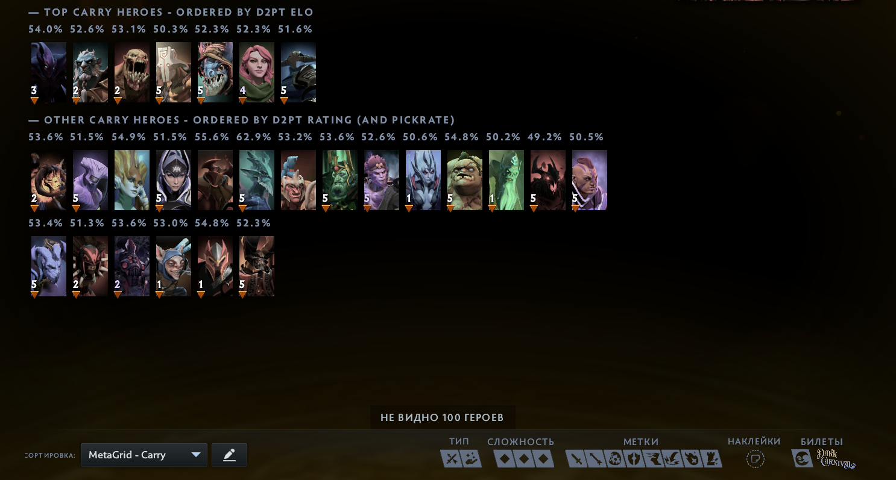
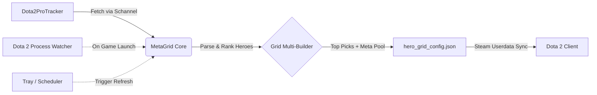

<div align="center">
  <picture>
    <source media="(prefers-color-scheme: dark)" srcset=".github/logo-dark.svg">
    <source media="(prefers-color-scheme: light)" srcset=".github/logo-light.svg">
    
  </picture>

  <h1>MetaGrid</h1>
  <p>Automated Dota 2 hero grids synchronized with high-MMR meta statistics.</p>
</div>

<div align="center">

[](LICENSE)
[](https://www.microsoft.com/windows)
[](https://v2.tauri.app)
[](https://svelte.dev)
[](https://www.rust-lang.org)
[](https://www.typescriptlang.org)

</div>

<div align="center">
  <a href="#overview">Overview</a> &middot;
  <a href="#screenshots">Screenshots</a> &middot;
  <a href="#features">Features</a> &middot;
  <a href="#installation">Installation</a> &middot;
  <a href="#how-it-works">How It Works</a> &middot;
  <a href="#development">Development</a>
</div>

---

## Overview

MetaGrid is an automated Windows desktop app and background tray utility for Dota 2. It pulls live high-MMR meta statistics directly from [dota2protracker.com](https://dota2protracker.com) and keeps your in-game hero grids updated for all 5 roles (Carry, Mid, Offlane, Support, Hard Support).

**Set and forget**: MetaGrid runs silently in the Windows system tray and does all the work for you. It monitors when Dota 2 starts and automatically writes fresh meta grids to your local Steam configuration without requiring manual interaction.

Grids are written directly to Dota's `hero_grid_config.json`. Existing user-created custom grids are safely preserved, and automatic backups are created on every write.

> [!TIP]
> **100% VAC & Matchmaking Safe — Zero Ban Risk**
> MetaGrid is completely safe to use and will never trigger VAC or game bans:
> - **No Process Injection or Memory Access**: MetaGrid never injects DLLs, reads/writes `dota2.exe` memory, or hooks game functions.
> - **Native JSON Configuration Only**: It strictly writes to `hero_grid_config.json` in your local `Steam/userdata/` folder — the exact same file Dota 2 modifies when you arrange heroes in the in-game layout editor.
> - **External Public Data**: Meta statistics are fetched directly from Dota2ProTracker via standard HTTPS calls, completely independent of the Dota 2 game client or Steam network traffic.

---

## Screenshots

<div align="center">

### Meta Dashboard (List View)


<br/><br/>

### In-Game Grid Preview


<br/><br/>

### In-Game Dota 2 Grid


<br/><br/>

### Settings


</div>

---

## Features

- **Automated Background Sync**: Runs silently in the system tray, updating hero grids on your chosen interval.
- **Process Watcher**: Automatically detects when `dota2.exe` launches and patches the meta before the match starts.
- **Live Meta Fetching**: Parses current patch meta from Dota2ProTracker with winrate, pickrate, and D2PT ratings.
- **In-Game Grid Sync**: Generates clean, per-role layouts formatted to match Dota 2's picking phase grid geometry.
- **Multi-Account Discovery**: Detects all local Steam user directories under `Steam/userdata/<id>/570/remote/cfg/`.
- **Atomic File Operations**: Safe writing mechanism using temporary files with `.metagrid.bak` fallback.
- **Fullscreen Adaptive Scaling**: Clean proportional UI scaling for high-resolution displays.
- **Tray & Startup Integration**: Runs minimized in the background with customizable autostart on system boot.
- **Localization**: Full interface support for English and Russian.

---

## Installation

### Option 1: Cargo Install (One Command)

```bash
cargo install --git https://github.com/maybewewill/metagrid
```
> Installs the standalone `metagrid` executable directly to your system (`~/.cargo/bin`). Run `metagrid` in your terminal to launch.

### Option 2: Windows Installer / Portable

1. Download `MetaGrid_x.y.z_x64-setup.exe` or `MetaGrid_x.y.z_x64_Portable.zip` from [Releases](https://github.com/maybewewill/metagrid/releases).
2. Run the app, pick your Steam account and language, then click **Fetch & Patch**.
3. In Dota 2, open **Heroes → Hero Grids** and select the **MetaGrid** layout.

---

## How It Works



Grid configuration path:
```
<Steam_Installation_Path>/userdata/<Account_ID>/570/remote/cfg/hero_grid_config.json
```

---

## Configuration

| Setting | Options | Description |
| :--- | :--- | :--- |
| **Role Labels** | `Named` / `POS 1-5` | Toggle role naming convention across the UI and in-game grid tabs. |
| **Refresh Interval** | `30m`, `1h`, `3h`, `6h`, `12h`, `24h` | Background scheduler sync interval. |
| **Steam Account** | `All accounts` or specific Steam ID | Target account selection. |
| **Start with Windows** | `Enabled` / `Disabled` | Launch minimized on system startup. |
| **Language** | `English` / `Russian` | UI language and grid category names. |

---

## Development

### Prerequisites
- Node.js 20+
- Rust 1.85+ stable (with MSVC toolchain)

### Commands

```bash
# Install dependencies
npm install

# Start development mode
npm run tauri dev

# Run frontend tests
npm test

# Run type checks
npm run check

# Run Rust tests
cargo test --manifest-path src-tauri/Cargo.toml

# Build release installer
npm run tauri build
```

---

## License

Distributed under the [MIT License](LICENSE).
