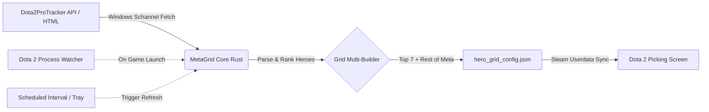

<div align="center">
  <picture>
    <source media="(prefers-color-scheme: dark)" srcset=".github/logo-dark.svg">
    <source media="(prefers-color-scheme: light)" srcset=".github/logo-light.svg">
    
  </picture>

  <h1>MetaGrid</h1>
  <p><strong>Automated Dota 2 hero grids synced with the high-MMR meta in real time.</strong></p>
</div>

<div align="center">

[](LICENSE)
[](https://www.microsoft.com/windows)
[](https://v2.tauri.app)
[](https://svelte.dev)
[](https://www.rust-lang.org)
[](https://www.typescriptlang.org)

</div>

<div align="center">
  <a href="#-overview">Overview</a> &middot;
  <a href="#-screenshots">Screenshots</a> &middot;
  <a href="#-features">Features</a> &middot;
  <a href="#-quick-start">Quick Start</a> &middot;
  <a href="#-how-it-works">How It Works</a> &middot;
  <a href="#-development">Development</a>
</div>

---

## 🎯 Overview

Drafting the right heroes in Dota 2 requires up-to-date knowledge of the current high-MMR pub meta. Manually arranging custom hero grids in the Dota 2 client is slow, tedious, and quickly becomes obsolete with each new patch or meta shift.

**MetaGrid** is a lightweight Windows desktop application and system tray utility that continuously scrapes top-tier pro statistics from [dota2protracker.com](https://dota2protracker.com), computes the strongest picks for every role (POS 1 through POS 5), and seamlessly updates Dota 2's `hero_grid_config.json` in the background.

> [!IMPORTANT]
> **Zero-Risk Guarantee:** MetaGrid modifies **only** its own designated grid configurations. Your personal custom grids, categories, and layouts are preserved byte-for-byte, and an automatic backup (`.metagrid.bak`) is created before the first write.

---

## 📸 Screenshots

<div align="center">

### Meta Dashboard (List View)
*Clean overview of top heroes by winrate and pickrate across all 5 roles with Hypatia typography and live D2PT ratings.*


<br/><br/>

### In-Game Grid Preview
*Pixel-accurate replica of how the grid categories and hero cards render inside the Dota 2 picking phase.*


<br/><br/>

### Settings & Customization
*Configure refresh intervals, Steam accounts, role naming styles (Named vs POS 1–5), and language preferences.*


</div>

---

## ✨ Features

- **Live Pro Tracker Scraping**: Direct ingestion from Dota2ProTracker (7000+ MMR, 8-day rolling window) with automatic hero slug mapping and rating calculations.
- **1-to-1 Dota 2 Grid Sync**: Generates exact 5-column and per-role grids (`POS 1` through `POS 5` or `Carry`, `Mid`, `Offlane`, `Support`, `Hard Support`) matching the in-game client coordinate system.
- **Dota 2 Launch Watcher**: Background process detection triggers an instant sync when `dota2.exe` starts so your grids are always fresh before your match begins.
- **Multi-Account Auto-Discovery**: Automatically discovers all local Steam user accounts under `Steam/userdata/<id>/570/remote/cfg/` with target filtering or all-accounts broadcast.
- **Safe Atomic Writes**: All writes use atomic temporary file replacement with automated `.bak` snapshot backups.
- **Responsive Proportional Scaling**: Built-in fullscreen mode with proportional CSS zoom adaptation for ultra-wide, 2K, and 4K displays.
- **System Tray & Autostart Integration**: Minimizes cleanly to the Windows notification area with instant **Fetch & Patch** trigger and Windows autostart toggle.
- **Bilingual Interface**: Full live-swapping localization for **English (EN)** and **Russian (RU)**.

---

## 🚀 Quick Start

### Installation

1. Download the latest installer (`MetaGrid_x.y.z_x64-setup.exe`) from [Releases](https://github.com/slash/metagrid/releases).
2. Run the setup wizard to install MetaGrid.
3. Launch **MetaGrid** from the Start Menu or Desktop.

### First Run

1. **Select Language & Account**: Choose your preferred language (**EN / RU**) and select your Steam account (or keep *All Accounts*).
2. **Click "Fetch & Patch"**: MetaGrid will download the latest meta snapshot and write the grids directly to your Dota 2 configuration.
3. **Open Dota 2**: Navigate to **Heroes → Hero Grids** and select the **MetaGrid** (or **POS 1–5**) grid from the dropdown menu.

---

## 🛠️ How It Works



### Safety & Storage Details

MetaGrid stores hero grid definitions in the standard Dota 2 Steam cloud directory:
```
<Steam_Installation_Path>/userdata/<Account_ID>/570/remote/cfg/hero_grid_config.json
```

- Existing grids created by the user or other tools remain completely intact.
- If a write error occurs, the original configuration is restored immediately from backup.

---

## ⚙️ Configuration Reference

| Setting | Options | Description |
| :--- | :--- | :--- |
| **Role Labels** | `Named` / `POS 1-5` | Toggle between traditional names (`Carry`, `Mid`, etc.) and position notation (`POS 1`, `POS 2`, etc.) across the UI and Dota 2 grid names. |
| **Refresh Interval** | `1h`, `3h`, `6h`, `12h`, `24h` | Background scheduler interval for scraping meta updates. |
| **Account** | `All` or specific Steam ID | Target specific Steam account or broadcast to all local users. |
| **Start with Windows** | `Enabled` / `Disabled` | Launch minimized to system tray on Windows startup. |
| **Language** | `English` / `Russian` | Live UI localization and grid category translation. |

---

## 💻 Tech Stack

- **Backend**: [Rust](https://www.rust-lang.org/) + [Tauri v2](https://v2.tauri.app/) (native OS integration, memory safety, system tray, atomic I/O)
- **Frontend**: [Svelte 5](https://svelte.dev/) (Runes reactivity) + [TypeScript](https://www.typescriptlang.org/) + [Vite](https://vitejs.dev/)
- **Styling**: [Tailwind CSS v4](https://tailwindcss.com/) + Custom Hypatia Sans Pro Typography
- **Animation**: [Motion One](https://motion.dev/)
- **Testing**: [Vitest](https://vitest.dev/) + [@testing-library/svelte](https://testing-library.com/) + `cargo test`

---

## 🔧 Development

### Prerequisites
- [Node.js](https://nodejs.org/) (v20+)
- [Rust](https://rustup.rs/) (1.85+ stable)
- Visual Studio C++ Build Tools (Windows)

### Commands

```bash
# Install dependencies
npm install

# Run application in development mode with hot-reload
npm run tauri dev

# Run frontend tests
npm test

# Run Svelte / TypeScript type-checks
npm run check

# Run Rust unit tests
cargo test --manifest-path src-tauri/Cargo.toml

# Run Rust strict lints
cargo clippy --manifest-path src-tauri/Cargo.toml --all-targets -- -D warnings

# Build production installer
npm run tauri build
```

---

## 📄 License

Distributed under the **MIT License**. See [`LICENSE`](LICENSE) for more details.
