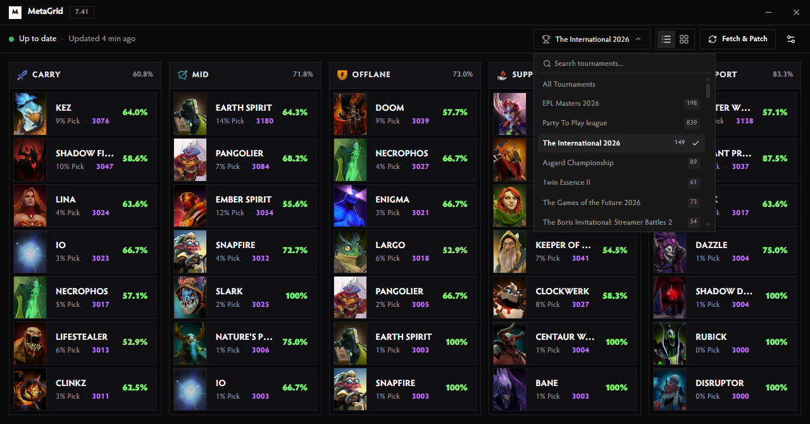
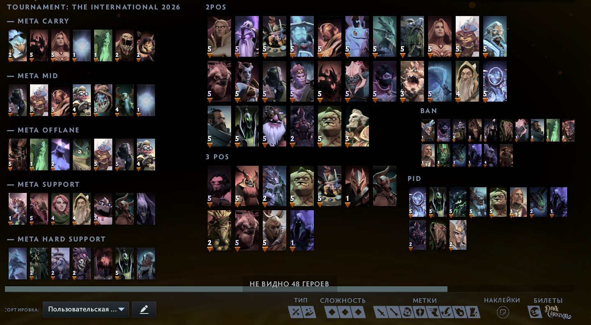

<div align="center">
  <picture>
    <source media="(prefers-color-scheme: dark)" srcset=".github/logo-dark.svg">
    <source media="(prefers-color-scheme: light)" srcset=".github/logo-light.svg">
    
  </picture>

  <h1>MetaGrid</h1>
  <p>Automated Dota 2 hero grids synchronized with high-MMR meta and live tournament statistics.</p>
</div>

<div align="center">

[](LICENSE)
[](https://www.microsoft.com/windows)
[](https://v2.tauri.app)
[](https://svelte.dev)
[](https://www.rust-lang.org)
[](https://www.typescriptlang.org)

</div>

<div align="center">
  <a href="#overview">Overview</a> &middot;
  <a href="#screenshots">Screenshots</a> &middot;
  <a href="#features">Features</a> &middot;
  <a href="#installation">Installation</a> &middot;
  <a href="#configuration">Configuration</a> &middot;
  <a href="#development">Development</a>
</div>

---

## Overview

MetaGrid is an automated Windows desktop application and background tray utility for Dota 2. It pulls live high-MMR meta statistics directly from [dota2protracker.com](https://dota2protracker.com) and keeps your in-game hero selection layouts updated for all 5 roles (Carry, Mid, Offlane, Support, Hard Support).

**Set and forget**: MetaGrid runs silently in the Windows system tray. It automatically syncs hero grids on your preferred interval and immediately updates your Steam configuration with native Steam Cloud validation, so your layouts load instantly on the very first launch.

Grids are written directly to Dota's `hero_grid_config.json`. Existing user-created custom grids are safely preserved with zero distortion, and automatic `.metagrid.bak` backups are created on every write.

> [!TIP]
> **100% VAC & Matchmaking Safe — Zero Ban Risk**
> MetaGrid is completely safe to use and will never trigger VAC or game bans:
> - **No Process Injection or Memory Access**: MetaGrid never injects DLLs, reads/writes `dota2.exe` memory, or hooks game functions.
> - **Native JSON Configuration Only**: It strictly writes to `hero_grid_config.json` in your local `Steam/userdata/` folder — the exact same file Dota 2 modifies when you arrange heroes in the in-game layout editor.
> - **External Public Data**: Meta statistics are fetched directly from Dota2ProTracker via standard HTTPS calls, completely independent of the Dota 2 game client or Steam network traffic.

---

## Screenshots

<div align="center">

### Meta Dashboard — Tournament Mode


<br/><br/>

### Grid Preview Mode


<br/><br/>

### In-Game Hero Grid Modes (Separate vs Merged)

<table>
  <tr>
    <th width="50%" align="center"><b>Separate Mode</b><br/><sub>5 Standalone Role Layouts</sub></th>
    <th width="50%" align="center"><b>Merge Mode</b><br/><sub>Live Compact META Injected into Existing Custom Grid</sub></th>
  </tr>
  <tr>
    <td align="center">
      
    </td>
    <td align="center">
      
    </td>
  </tr>
</table>

<br/><br/>

### Settings & Preferences


</div>

---

## Features

- **Automated Background Sync**: Runs silently in the system tray, automatically updating hero grids on your chosen schedule (`15m` to `24h`).
- **Live Tournament Meta**: Parse tournament leagues dynamically from D2PT (The International, BLAST Slam, ESL One, DreamLeague, etc.) with custom banners and role categories.
- **Dual Grid Modes**:
  - **Separate**: Generates 5 dedicated role grids (`MetaGrid - Carry`, `MetaGrid - Mid`, etc.) with top heroes and remaining heroes sorted by D2PT rating.
  - **Merge**: Injects a compact 7-hero-per-role meta column (`— META CARRY`, `— META MID`, etc.) directly into your existing custom layout, shifting your custom categories with zero distortion.
- **Clean In-Game Stats**: Displays exact unrounded winrates (`54.2%`) and pickrates, cleanly formatting perfect `100%` rates.
- **Multi-Account Discovery**: Automatically detects all local Steam user accounts under `Steam/userdata/<id>/570/remote/cfg/`.
- **Atomic File Operations**: Safe write mechanism using temporary files with automatic rollback and backups.
- **System Tray Integration**: Minimize and close buttons tuck the application into the tray for zero taskbar clutter.
- **Bilingual Interface**: Full interface support for English and Russian.

---

## Installation

### Option 1: Cargo Install (One Command)

```bash
cargo install --git https://github.com/maybewewill/metagrid
```
> Installs the standalone `metagrid` executable directly to your system (`~/.cargo/bin`). Run `metagrid` in your terminal to launch.

### Option 2: Windows Installer / Portable

1. Download `MetaGrid_x.y.z_x64-setup.exe` or `MetaGrid_x.y.z_x64_Portable.zip` from [Releases](https://github.com/maybewewill/metagrid/releases).
2. Run the app, pick your Steam account and language, then click **Fetch & Patch**.
3. In Dota 2, open **Heroes → Hero Grids** and select your updated layout.

---

## Configuration

| Setting | Options | Description |
| :--- | :--- | :--- |
| **Grid Mode** | `Separate` / `Merge` | Choose between 5 standalone role grids or injecting a live META column into an existing grid. |
| **Target Grid** | Custom grid name | Select which existing hero layout to inject the META column into (when Merge mode is active). |
| **Meta Source** | `High-MMR Pubs` / `Tournaments` | Toggle between top 8K+ MMR pub matches and professional tournaments. |
| **Tournament** | Dropdown list | Select specific tournament league to parse (TI, BLAST, ESL, etc.). |
| **Role Labels** | `Named` / `POS 1-5` | Toggle role naming convention across the UI and in-game grid tabs. |
| **Refresh Interval** | `15m`, `30m`, `1h`, `3h`, `6h`, `12h`, `24h` | Background scheduler sync interval. |
| **Steam Account** | `All accounts` or specific Steam ID | Target account selection. |
| **Start with Windows** | `Enabled` / `Disabled` | Launch minimized on system startup. |
| **Language** | `English` / `Russian` | UI language and grid category names. |

---

## Development

### Prerequisites
- Node.js 20+
- Rust 1.85+ stable (with MSVC toolchain)

### Commands

```bash
# Install dependencies
npm install

# Start development mode
npm run tauri dev

# Run frontend tests
npm test

# Run type checks
npm run check

# Run Rust tests
cargo test --manifest-path src-tauri/Cargo.toml

# Build release installer
npm run tauri build
```

---

## License

Distributed under the [MIT License](LICENSE).
